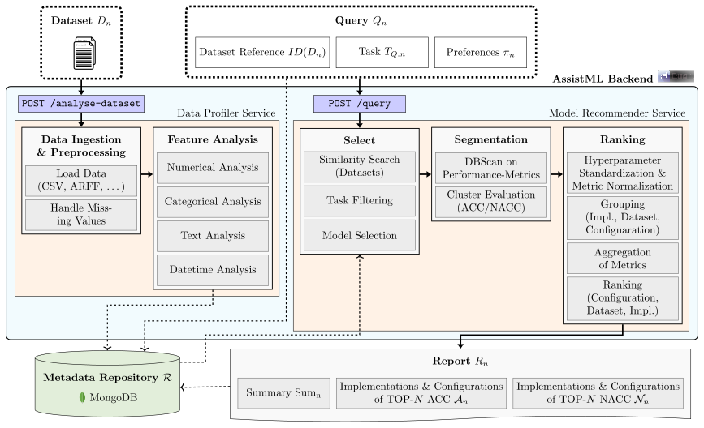
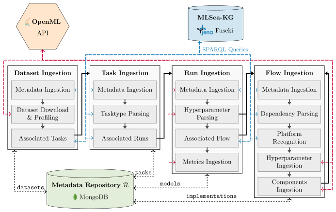

# AssistML: An alternative to AutoML recommending ML Solutions

> 24.03.2025


## Abstract

The adoption of machine learning (ML) in organizations is characterized by the use of multiple ML software components. When building ML systems out of these software components, citizen data scientists face practical requirements which go beyond the known challenges of ML, e. g., data engineering or parameter optimization. They are expected to quickly identify ML system options that strike a suitable trade-off across multiple performance criteria. These options also need to be understandable for non-technical users. Addressing these practical requirements represents a problem for citizen data scientists with limited ML experience. This calls for a concept to help them identify suitable ML software combinations. Related work, e. g., AutoML systems, are not responsive enough or cannot balance different performance criteria.

This paper explains how AssistML, a novel concept to recommend ML solutions, i. e., software systems with ML models, can be used as an alternative for predictive use cases. Our concept collects and preprocesses metadata of existing ML solutions to quickly identify the ML solutions that can be reused in a new use case. We implement AssistML and evaluate it with two exemplary use cases. Results show that AssistML can recommend ML solutions in line with users' performance preferences in seconds. Compared to AutoML, AssistML offers citizen data scientists simpler, intuitively explained ML solutions in considerably less time. Moreover, these solutions perform similarly or even better than AutoML models.

## Repository organization

- **backend**: The core system that recommends implementations and configurations for new datasets. Main script is `backend/run.py`
- **frontend**: User interface to make the backend accessible and present its response. Main script is `frontend/run.py`
- **ingestion**: A Pipeline which creates a metadata repository based on OpenML while utilizing [MLSea](https://dtai-kg.github.io/MLSea-KGC/). Can be executed with CLI as `python ingestion/cli.py` (see option `--help` for more information).
- **common**: Shared code between the frontend, backend and the ingestion. Contains the data models of the metadata repository and data transfer objects for the communication between the frontend and the backend.
- **mongodb**: Configuration files used by dockerized MongoDB.

## Architecture

### Backend


### Ingestion


## Getting started

1. Clone the repository.
2. Launch the docker compose configuration
3. Modify the .env file of the ingestion pipeline to point to a running SPARQL endpoint containing the [MLSea](https://dtai-kg.github.io/MLSea-KGC/) metadata.
4. Run the ingestion pipeline to create the metadata repository (using the OpenML API)
5. In a web browser go to http://localhost:8050


## Dockerized Version

This repository contains a dockerized version of the project.

### Prerequisites

- Docker
- Docker Compose

### Installation and Start

1. Clone the repository:
    ```bash
    git clone https://github.com/MorpheusI0/assistml.git
    cd assistml
    ```

2. Build and start the Docker containers:
    ```bash
    docker-compose up --build
    ```

3. The application should now be running and accessible at `http://localhost:8050`.

### Docker Commands

- To stop the containers:
    ```bash
    docker-compose down
    ```

- To start the containers in the background:
    ```bash
    docker-compose up -d
    ```

- To view the logs of the containers:
    ```bash
    docker-compose logs
    ```

## Disclaimer

This is an experimental codebase, not ready for production.

The contents of this repository are provided as-is, with no implied warranty.

No maintenance or support for applications of this codebase is provided.